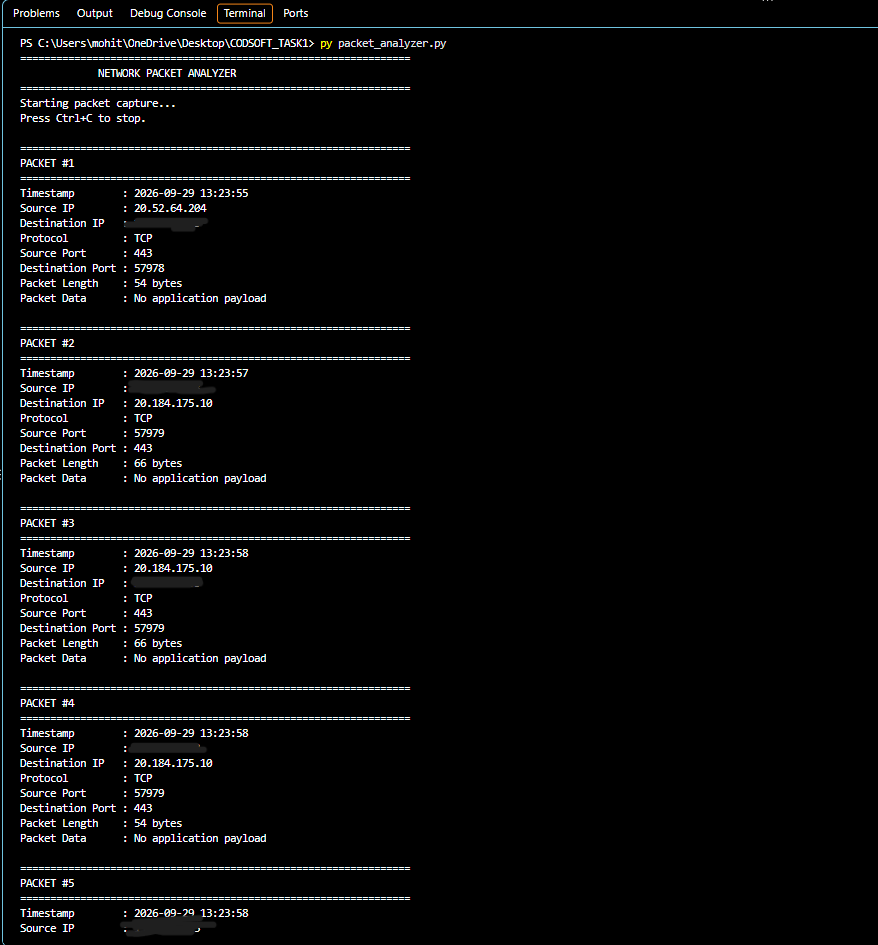
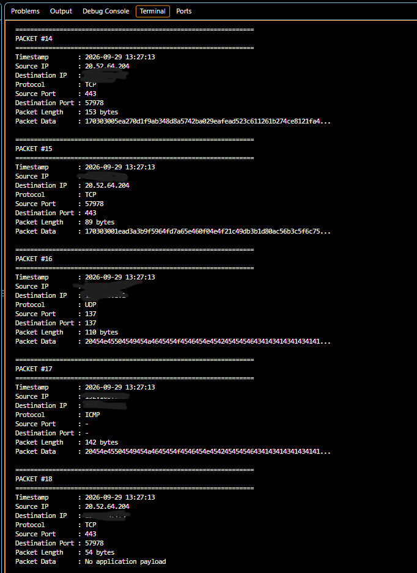
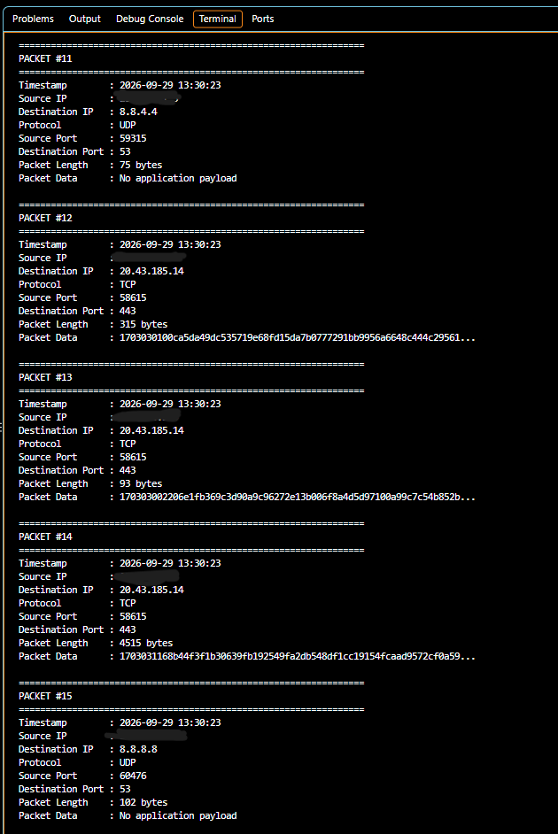

# Network Packet Analyzer

A Python-based network packet analyzer developed as part of the CodSoft Cyber Security Internship.

The application uses Scapy to capture and inspect network packets and displays important information such as source IP, destination IP, protocol, ports, packet length, timestamp, and packet data.

## Features

- Capture live network packets
- Identify source and destination IP addresses
- Detect TCP, UDP, and ICMP protocols
- Display source and destination ports
- Display packet length
- Display packet timestamp
- Display packet data in hexadecimal format
- Number captured packets
- Present captured information in a clear and organized format

## Technologies Used

- Python 3
- Scapy
- Git & GitHub

## Project Structure

```text
CODSOFT_TASK1/
│
├── packet_analyzer.py
├── requirements.txt
├── README.md
├── LICENSE
│
└── screenshots/
    ├── packet-capture.png
    ├── packet-data.png
    └── packet-details.png
```

## Installation

### 1. Clone the repository

```bash
git clone https://github.com/mohitnemade07/CODSOFT_TASK1.git
```

### 2. Navigate to the project directory

```bash
cd CODSOFT_TASK1
```

### 3. Install the required dependency

```bash
py -m pip install -r requirements.txt
```

## Usage

Run the packet analyzer:

```bash
py packet_analyzer.py
```

The application will start capturing packets and display information in the terminal.

Press `Ctrl + C` to stop packet capture.

## Example Output

```text
============================================================
PACKET #11
============================================================
Timestamp        : 2026-09-29 13:54:01
Source IP        : xxx.xxx.xxx.xxx
Destination IP   : 192.168.x.x
Protocol         : TCP
Source Port      : 443
Destination Port : 52042
Packet Length    : 153 bytes
Packet Data      : 170303005e97e67db145e4ce5a599938...
```

## Screenshots

### Packet Capture



### Packet Details



### Packet Data



## Internship Task

**CodSoft Cyber Security Internship — Task 1**

### Network Packet Analyzer

The objective of this task was to develop a Python application capable of capturing packets transmitted over a network, inspecting their communication and protocol behavior, extracting important packet information, and presenting the captured information in an organized format.

## Ethical Use

This project is intended for educational and authorized network-analysis purposes only. Packet capture should only be performed on networks and systems for which you have permission.

## Author

**Mohit Nemade**

GitHub: https://github.com/mohitnemade07